# Daily UI
100 days of awesome and cool front-end design and development.

* _Daily UI 001_

    * **Sign Up**
    
        Hint: Design a sign up page, modal, form, app screen, etc.(It's up to you!)
        Don't forget to share on [Twitter](https://twitter.com/MosesOkemwa) when you're done.
            
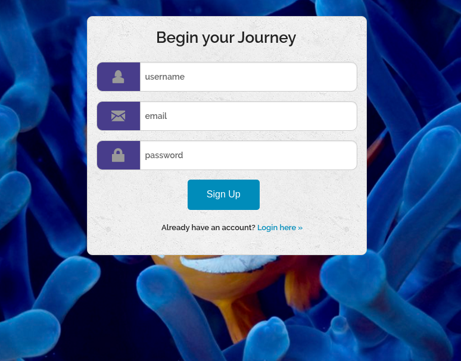

* _Daily UI 002_

    * **Credit Card Checkout**

        Hint: Design a credit card checkout form or page.
        Don't forget the important elements such as the numbers, dates, security numbers, etc. (It's up to you!)
        Don't forget to share on [Twitter](https://twitter.com/MosesOkemwa) when you're done.

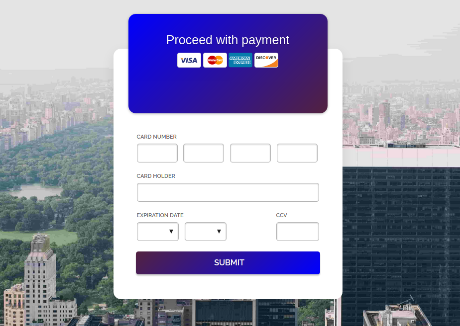

* _Daily UI 003_

    * **Landing Page** (above the fold)

        Hint: What's the main focus?
        Is it for a book, an album, a mobile app, a product?
        Consider important landing page elements
        (call-to-actions, clarity, etc.)
        (It's up to you!) Don't forget to share on [Twitter](https://twitter.com/MosesOkemwa) when you're done.

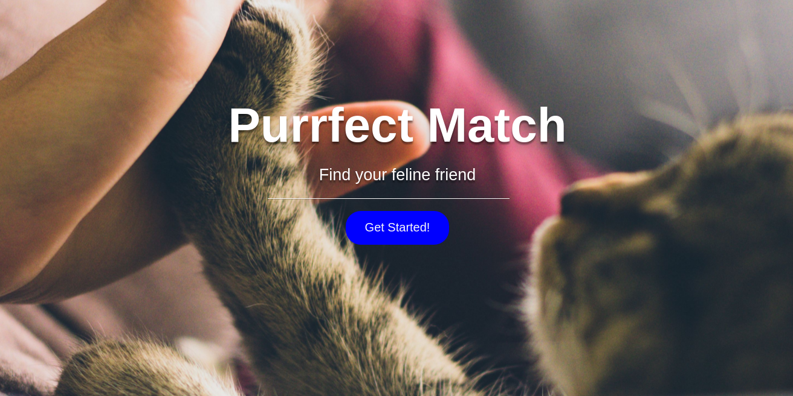

* _Daily UI 004_

    * **Calculator**

    Hint: Design a calculator. Standard, scientific, or specialty calculator for something such as a mortgage? 
    Is it for a phone, a tablet, a web app? (It's up to you!)
    Don't forget to share on [Twitter](https://twitter.com/MosesOkemwa) when you're done.
    
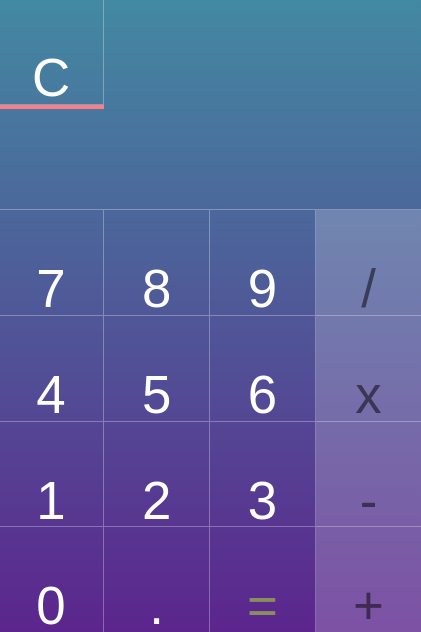

* _Daily UI 005_

    * **App Icon**
    
    Hint: Design an app icon.
    What best represents the brand or product? Or is it incredibly unique?
    Does it look great at a distance and does it stand out when put on your home screen alongside other apps?
    Don't forget to share on [Twitter](https://twitter.com/MosesOkemwa) when you're done.

* _Daily UI 006_

    * **User Profile**
 
    Hint: Design a user profile and be mindful of the most important data, names, imagery, placement, etc.
    Is it for a serious profile? A social profile? (It's up to you!).
    Don't forget to share on [Twitter](https://twitter.com/MosesOkemwa) when you're done.
    
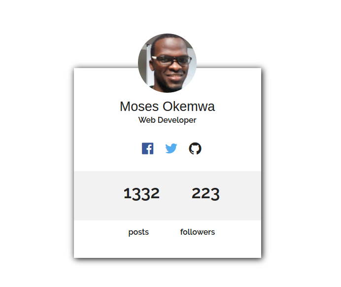

* _Daily UI 007_

    * **Settings**
    
    Hint: Design settings for something.
    Is it for security or privacy settings? Game settings? What is it and what's important? (It's up to you!)
    Don't forget to share on [Twitter](https://twitter.com/MosesOkemwa) when you're done.
    
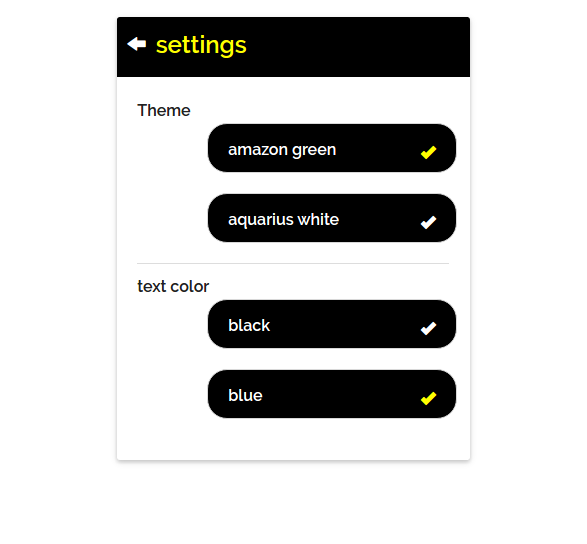

* _Daily UI 008_

    * **404 page**
    
    Hint: Design a 404 page. Does it suit the brand's style? Is it user-friendly? (It's up to you!)
    Don't forget to share on [Twitter](https://twitter.com/MosesOkemwa) when you're done.

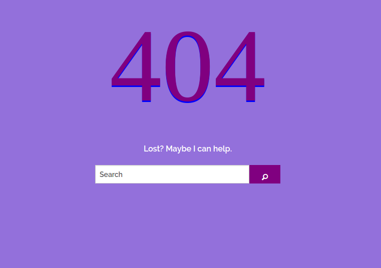

* _Daily UI 009_

    * **Music Player**
    
    Hint: Design a music player. Consider the controls, placements, imagery such as the artist or album cover, etc. (It's up to you!) 
    Don't forget to share on [Twitter](https://twitter.com/MosesOkemwa) when you're done.

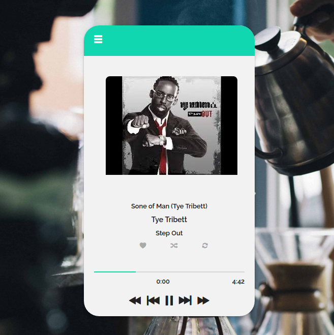

* _Daily UI 010_
    
    * **Social Share**
    
    
    Hint: Design a social share button/icon and be mindful of the size, imagery, placement, and purpose for sharing. (As always, it's up to you!) 
    Don't forget to share on [Twitter](https://twitter.com/MosesOkemwa) when you're done.

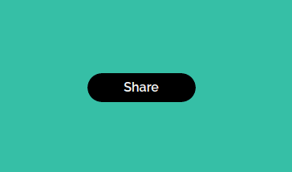

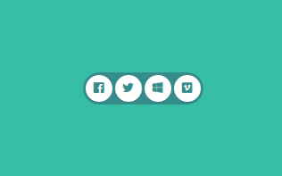

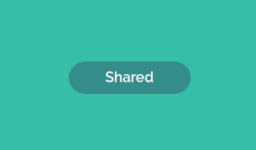

* _Daily UI 011_

    * **Flash Message (Error/Success)**
    
    Hint: Design a Flash Message with both the outcome for an error and success. Is it for a sign up form? A download/upload message? (As always, it's up to you!)
    Don't forget to share on [Twitter](https://twitter.com/MosesOkemwa) when you're done.
    
    
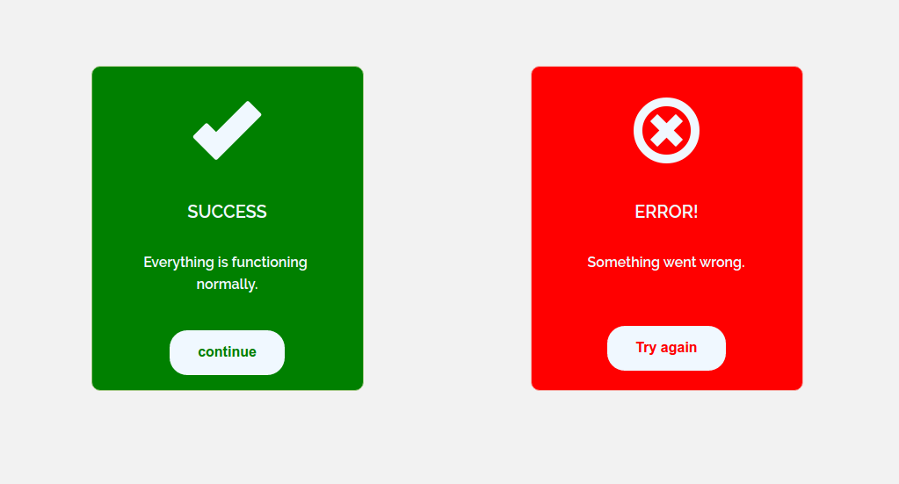

* _Daily UI 012_
    
    * **E-Commerce Shop(Single Item)**
    
    
    Hint: Design an e-commerce shop. Is it simple for a local business or a large online retailer? Is it for clothing, shoes, handmade soap, or something else?
    
    Consider the brand, the products offered, product views, product options, desired actions (conversions, product views, etc.) and the users! (As always, it's up to you!) 
    
    Don't forget to share on [Twitter](https://twitter.com/MosesOkemwa) when you're done.

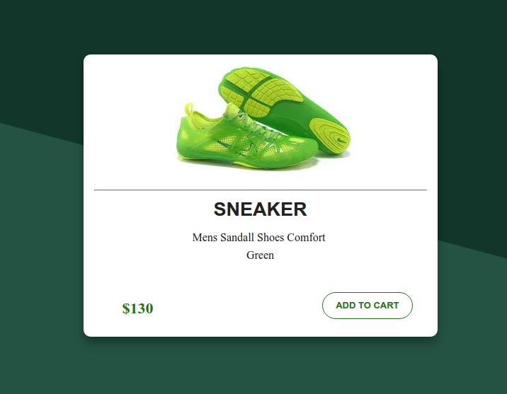