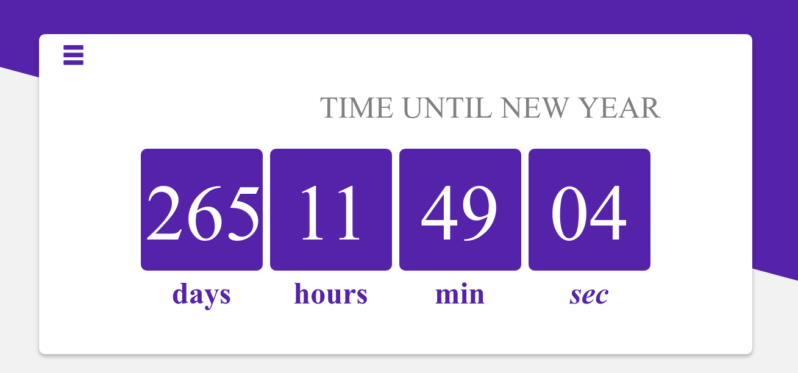
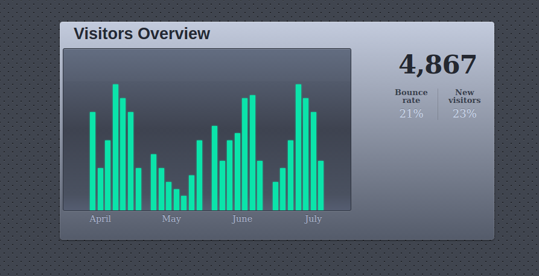

# Daily UI
100 days of awesome and cool front-end design and development.

* _Daily UI 001_

    * **Sign Up**
    
        Hint: Design a sign up page, modal, form, app screen, etc.(It's up to you!)

            

---

* _Daily UI 002_

    * **Credit Card Checkout**

        Hint: Design a credit card checkout form or page.
        
        Don't forget the important elements such as the numbers, dates, security numbers, etc. (It's up to you!)

---

* _Daily UI 003_

    * **Landing Page** (above the fold)

        Hint: What's the main focus?
        
        Is it for a book, an album, a mobile app, a product?
        
        Consider important landing page elements (call-to-actions, clarity, etc.) (It's up to you!)

        

---

* _Daily UI 004_

    * **Calculator**

    Hint: Design a calculator. Standard, scientific, or specialty calculator for something such as a mortgage? 
    
    Is it for a phone, a tablet, a web app? (It's up to you!)

    
    

---

* _Daily UI 005_

    * **App Icon**
    
    Hint: Design an app icon.
    
    What best represents the brand or product? Or is it incredibly unique?
    
    Does it look great at a distance and does it stand out when put on your home screen alongside other apps?

---

* _Daily UI 006_

    * **User Profile**
 
    Hint: Design a user profile and be mindful of the most important data, names, imagery, placement, etc.
    
    Is it for a serious profile? A social profile? (It's up to you!).

    

---

* _Daily UI 007_

    * **Settings**
    
    Hint: Design settings for something.
    
    Is it for security or privacy settings? Game settings? What is it and what's important? (It's up to you!)

    
    

---

* _Daily UI 008_

    * **404 page**
    
    Hint: Design a 404 page. Does it suit the brand's style? Is it user-friendly? (It's up to you!)

---

* _Daily UI 009_

    * **Music Player**
    
    Hint: Design a music player. Consider the controls, placements, imagery such as the artist or album cover, etc. (It's up to you!)

---

* _Daily UI 010_
    
    * **Social Share**
    
    
    Hint: Design a social share button/icon and be mindful of the size, imagery, placement, and purpose for sharing. (As always, it's up to you!)

---

* _Daily UI 011_

    * **Flash Message (Error/Success)**
    
    Hint: Design a Flash Message with both the outcome for an error and success. Is it for a sign up form? A download/upload message? (As always, it's up to you!)

        

---

* _Daily UI 012_
    
    * **E-Commerce Shop(Single Item)**
    
    
    Hint: Design an e-commerce shop. Is it simple for a local business or a large online retailer? Is it for clothing, shoes, handmade soap, or something else?
    
    Consider the brand, the products offered, product views, product options, desired actions (conversions, product views, etc.) and the users! (As always, it's up to you!)

")

---

* _Daily UI 013_

    * **Direct Messaging**
    
    
    Hint: Design a Direct Messaging app, profile, or chatbox.
    
    Consider the parties involved in the messages, images, placement, and context of the messages.
    
    Are the messages for social purposes? Customer support? (As always, it's up to you!)

    

---

* _Daily UI 014_
    
    * **Countdown Timer**
    
    Hint: Design a Countdown Timer. 
    
    Is it for an app? An interface for an oven? A sport related countdown? A launch countdown for NASA?

---

* _Daily UI 015_
    
    * **On/Off Switch**

 
    Hint: Design an On/Off Switch. Consider what's being turned on/off and how it should be done. (As always, it's up to you!) 

---

* _Daily UI 016_

    * **Pop-Up / Overlay**
    
    Hint: Design a Pop-Up/Overlay. Is it a web sign-up form that pops up? Is it an ad overlay?(As always, it's up to you!)

---

* _Daily UI 017_

    * **Email Receipt**

    Hint: Design an Email Receipt. What was purchased? On what date? Consider other elements such as a customer support info, a tracking number, pictures, related items, etc. (As always, it's up to you!)

---

* _Daily UI 018_

    * **Analytics Chart**

    Hint: Design an analytics chart. Is it to be used for web or app analytics, a health monitor, e-commerce analytics?

    Consider filters, chart types, and the core features/statistics the user would need most.(As always, it's up to you!)

---

* _Daily UI 019_

    * **Leaderboard**

    Hint: Design a leaderboard. Is it for gaming, sports, politics, or something else? Consider the important statistics to show, percentages, points, profile pictures, etc.(As always, it's up to you!)

---

* _Daily UI 020_

    * **Location Tracker**

    Hint: Design a location tracker. Consider the icon, placement, and purpose of location. Mapping something? Is it a tracking beacon? Is the NSA tracking you? ok, maybe they are ;) (As always, it's up to you!)

---

* _Daily UI 021_

    * **Home Monitoring Dashboard**

    Hint: Design a home monitoring dashboard. Be creative! What would make a dashboard visually appealing and fun to use, while also being mindful of the data?

    Try to make it a realistic exercise as if it were your own dashboard... one that you need to refer to daily. What is the most relevant data and what's the most appropriate placement for it?(As always, it's up to you!)

---

* _Daily UI 022_

    * **Search**

    Hint: Design something search related. It could be a search bar, an advanced search window, a search function, etc. (As always, it's up to you!)

---

* _Daily UI 023_

    * **Onboarding**

    Hint: Design something onboarding related. Are you recruiting people for an organization? To sign up for a new website? A mobile app?(As always, it's up to you!)

---

* _Daily UI 024_

    * **Boarding Pass**

    Hint: Design a boarding pass. Consider the origin, the destination, gates, seats, the airline, etc.(As always, it's up to you!)

---

* _Daily UI 025_

    * **TV App**

    Hint: Design an app for a smart TV. What type of app is it? What are the features/controls? Does it have a carousel selection feature? What it is? (As always, it's up to you!)

---

* _Daily UI 026_

    * **Subscribe**

    Hint: Design a subscribe form, button, widget, etc. What type of information are you looking to capture from the user? Their name and email? Their zip code? Something else? (As always, it's up to you!)

---
